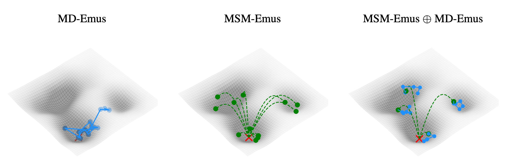

# MarS-FM: Generative Modeling of Molecular Dynamics via Markov State Models

[](https://openreview.net/forum?id=jP3HnYXoIp) [](https://arxiv.org/abs/2509.24779)

<p align="center">
  
</p>

Official implementation of **MarS-FM** (Markov Space Flow Matching). MarS-FM introduces a new class of generative models—MSM Emulators—that learn to sample transitions across discrete states defined by an underlying Markov State Model (MSM), overcoming the limitations of fixed-lag models.

---

## Installation

```bash
conda env create -f mars.yaml
conda activate mars
```

## Datasets

1. **Tetrapeptides (4AA)** — Download from [MDGen](https://github.com/bjing2016/mdgen)
2. **MD-CATH** — Download from [HuggingFace](https://huggingface.co/datasets/compsciencelab/mdCATH)

## Prepare Dataset Trajectories

Tetrapeptides:
```bash
python -m scripts.prepare_data.prep_sims_4AA \
  --split splits/4AA.csv --sim_dir data/4AA_sims \
  --outdir data/4AA_sims --num_workers [N] --stride 100
```

MD-CATH:
```bash
python -m scripts.prepare_data.prep_sims_mdcath \
  --split splits/mdCATH.txt --sim_dir data/md_cath \
  --outdir data/md_cath_processed --num_workers [N]
```

## Create MSM Clusters

Tetrapeptides:
```bash
python -m scripts.msm_clusters.create_msm_states_4AA \
  --data_dir data/4AA_sims --num_workers [N] --msm_num_states 10
```

MD-CATH:
```bash
python -m scripts.msm_clusters.create_msm_states_mdcath \
  --data_dir data/md_cath --cluster_data_dir data/md_cath_processed \
  --msm_num_states 10 --temp 450
```

## Training

Tetrapeptides:
```bash
python -m scripts.train \
  --train_split splits/4AA_train.csv --val_split splits/4AA_val.csv \
  --data_dir ./data/4AA_sims --model_dir ./workdir \
  --abs_pos_emb --crop 4 --ckpt_freq 100 --val_repeat 25 \
  --epochs 2001 --wandb --run_name 4AA \
  --num_workers 4 --msm_num_states 10 --msm_lagtime 200
```

MD-CATH:
```bash
python -m scripts.train \
  --train_split splits/mdCATH_train.csv --val_split splits/mdCATH_val.csv \
  --data_dir ./data/md_cath_processed --model_dir ./workdir \
  --batch_size 8 --crop 256 --val_repeat 5 --epochs 1000 \
  --mdcath --ckpt_freq 25 --wandb --run_name mdcath \
  --msm_num_states 10 --clusters_per_batch 2 --samples_per_cluster 12 \
  --msm_lagtime 50 --data_temperature 450
```

## Sampling

**Tetrapeptides** (MarS + MDGen):
```bash
python -m scripts.generate \
  --mars_ckpt ${mars_ckpt} \
  --mdgen_ckpt ${mdgen_ckpt} \
  --data_dir data/4AA_sims \
  --split splits/4AA_test.csv \
  --out_dir ${out_dir} \
  --calls_mars 50
```

**MD-CATH** — Hierarchical tree sampling (MarS only):
```bash
python -m scripts.generate \
  --mars_ckpt ${mars_ckpt} \
  --data_dir data/md_cath \
  --split splits/mdCATH_test.csv \
  --out_dir ${out_dir} \
  --mdcath --temp 450 \
  --calls_mars 200 --tree \
  --max_mars_samples 500 --tree_parallel_chunk 100 \
  --skip_existing
```

**MD-CATH** — MarS + MDGen sampling:
```bash
python -m scripts.generate \
  --mars_ckpt ${mars_ckpt} \
  --mdgen_ckpt ${mdgen_ckpt} \
  --data_dir data/md_cath \
  --split splits/mdCATH_test.csv \
  --out_dir ${out_dir} \
  --mdcath --temp 450 \
  --calls_mars 50 --calls_mdgen 1 \
  --skip_existing
```

## Analysis

Tetrapeptides:
```bash
python -m scripts.analysis.analyze_4AA \
  --mddir ./data/4AA_sims --plot --num_workers 50 --pdbdir ${out_dir}
```

MD-CATH:
```bash
python -m scripts.analysis.analyze_mdcath \
  --pdbdir ${out_dir} \
  --mdcath_processed_dir data/md_cath_processed \
  --mddir data/md_cath \
  --num_workers [N] --xtc --truncate 500 --temp 450 --msm_lag 50
```

## Repository Structure

```
mars/
├── model/
│   ├── model.py              # MarS neural network (DiT + IPA)
│   └── module.py             # PyTorch Lightning training & inference modules
├── data/
│   ├── dataset.py            # 4AA and MD-CATH dataset classes
│   └── geometry.py           # Coordinate frame & torsion angle conversions
├── vendored/
│   ├── openfold/             # Vendored from OpenFold (Apache 2.0)
│   │   ├── ipa.py
│   │   ├── primitives.py
│   │   ├── protein.py
│   │   ├── residue_constants.py
│   │   ├── rigid_utils.py
│   │   └── tensor_utils.py
│   ├── ema.py                # Exponential moving average (from OpenFold)
│   └── mha.py                # Multi-head attention with RoPE (from ESM)
├── transport.py              # Flow matching (GVP path + ODE sampler)
├── analysis.py               # Evaluation metrics (JSD, KL, MSM, TICA, ...)
└── utils.py                  # Seeding, PDB I/O, rigid-body offsets
scripts/
├── train.py                  # Training entry point
├── training_args.py          # Argument parser
├── generate.py               # Trajectory generation (flat & tree sampling)
├── analysis/
│   ├── analyze_4AA.py        # Tetrapeptide evaluation pipeline
│   └── analyze_mdcath.py     # MD-CATH evaluation pipeline
├── prepare_data/
│   ├── prep_sims_4AA.py      # Tetrapeptide trajectory preprocessing
│   └── prep_sims_mdcath.py   # MD-CATH trajectory preprocessing
└── msm_clusters/
    ├── create_msm_states_4AA.py      # MSM clustering for tetrapeptides
    └── create_msm_states_mdcath.py   # MSM clustering for MD-CATH
```

## Citation

```bibtex
@article{kapusniak2025mars,
  title={MarS-FM: Generative Modeling of Molecular Dynamics via Markov State Models},
  author={Kapu{\'s}niak, Kacper and Gabellini, Cristian and Bronstein, Michael and Tossou, Prudencio and Di Giovanni, Francesco},
  journal={arXiv preprint arXiv:2509.24779},
  year={2025}
}
```
